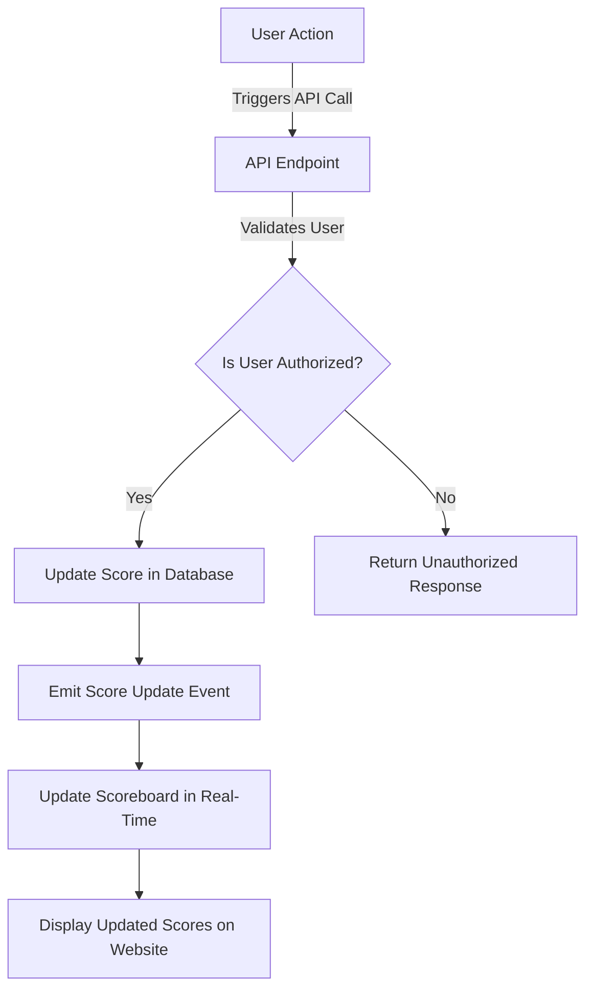

# Flow Diagram for Scoreboard Service

This diagram illustrates the flow of execution for the scoreboard service, showing how user actions lead to score updates while ensuring authorization checks are in place.